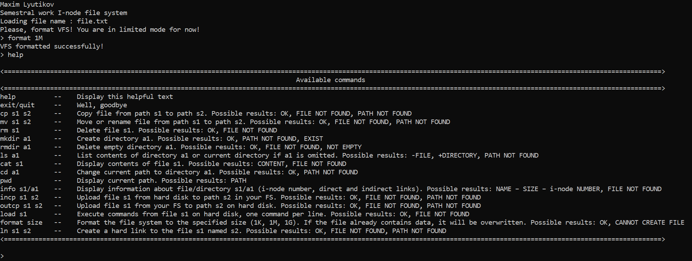

# C++ Virtual File System



## Overview
**C++ Virtual File System** is a C++ project that implements **a virtual file system** based on [i-nodes](https://en.wikipedia.org/wiki/Inode). The system simulates common file and directory operations in an environment that closely mimics real-world file systems. It is designed with modularity and extensibility in mind, making it easy to manage files, directories, and additional advanced operations.

## Features
- **Virtual File System Simulation**: Implements core file system functionalities using [i-nodes](https://en.wikipedia.org/wiki/Inode).
- **Basic Operations**: Supports file copy (`cp`), move/rename (`mv`), and deletion (`rm`).
- **Directory Management**: Create (`mkdir`), remove (`rmdir`), list (`ls`), and navigate directories (`cd`, `pwd`).
- **File Operations**: View file contents (`cat`), display file/directory metadata (`info`), and execute command sequences (`load`).
- **Import/Export**: Transfer files between the virtual file system and the physical disk using `incp` and `outcp`.
- **Formatting**: Initialize or reformat the virtual file system with a specific size using `format`.
- **Advanced Options**: Additional support for hard links, symbolic links, file concatenation, and file shortening.

## Requirements
- A modern C++ compiler (e.g., `g++`)
- Make utility
- Linux environment (or WSL on Windows)

## Installation and Compilation
To compile the project, ensure that you have g++ and make installed. You can install them with the following command:

```bash
sudo apt-get install g++ make -y
```

Once the prerequisites are installed, navigate to the project directory and run:

```bash
make
```

This will compile the project using the target name **SemestralWork** defined in the Makefile.

## Usage
After successful compilation, start the virtual file system with:

```bash
./SemestralWork [path_to_virtual_disk]
```

Replace `[path_to_virtual_disk]` with the path to the file that will serve as the virtual disk. If the specified file does not exist, it will be created automatically. Note that before performing any file operations, you must initialize the file system using the `format` command.

Then you will need to format you file system (for example, only `10 megabytes`):

```bash
format 10M
```

## Supported Commands
The virtual file system accepts both absolute and relative paths and provides the following commands:

- `cp s1 s2`  
  Copy file `s1` to location `s2`.

- `mv s1 s2`  
  Move or rename file `s1` to `s2`.

- `rm s1`  
  Remove file `s1`.

- `mkdir a1`  
  Create a new directory `a1`.

- `rmdir a1`  
  Remove an empty directory `a1`.

- `ls [directory]`  
  List the contents of the specified directory. If no directory is specified, the current directory is listed.

- `cat s1`  
  Display the contents of file `s1`.

- `cd a1`  
  Change the current directory to `a1`.

- `pwd`  
  Display the current working directory.

- `info s1` or `info a1`  
  Display metadata (such as size, i-node number, and direct/indirect links) for the specified file or directory.

- `incp s1 s2`  
  Import a file from the physical disk (`s1`) into the virtual file system at location `s2`.

- `outcp s1 s2`  
  Export a file from the virtual file system (`s1`) to the physical disk at location `s2`.

- `load s1`  
  Execute a series of commands from file `s1` (one command per line).

- `format [size]`  
  Format the virtual file system to the specified size. Any existing data will be overwritten or a new file will be created if it does not exist.

Use the `help` command within the system to list all available commands and their usage details.

## Project Structure
- **Utils**: Contains helper functions for file operations and string manipulation.
- **Constants**: Defines global constants, command strings, and error messages.
- **Inode**: Manages the i-node structure representing files and directories.
- **DirectoryItem & Directory**: Handle individual directory entries and overall directory structures.
- **Superblock**: Stores essential metadata and layout information for the virtual file system.
- **VirtualFileSystem**: Implements the core logic and operations of the file system.
- **CommandProcessor**: Interprets and executes user commands.
- **Main**: Entry point for initializing the system and starting the command loop.

## Additional Notes
- Ensure that the virtual disk file is properly formatted before use to prevent instability or data loss.
- Always exit the application using `exit` or `quit` to guarantee that all changes are correctly saved.
- The system supports advanced features like hard links and symbolic links, which behave similarly to their real-world counterparts.

## License

[MIT License](LICENSE)

---

*Happy C++ coding and using this virtual file system!*
